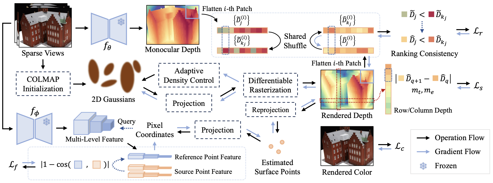

<h2 align="center">
  😇FatesGS: Fast and Accurate Sparse-View Surface Reconstruction using Gaussian Splatting with Depth-Feature Consistency
</h2>
<h4 align="center">AAAI 2025</h4>
<div align="center">
  <a href='https://github.com/alvin528' target='_blank'>Han Huang</a>*&emsp;
  <a href='https://yulunwu0108.github.io/' target='_blank'>Yulun Wu</a>*&emsp;
  Chao Deng&emsp;
  Ge Gao&dagger;&emsp;
  Ming Gu&emsp;
  <a href='https://yushen-liu.github.io/' target='_blank'>Yu-Shen Liu</a><br>
  Tsinghua University<br>
  <small>*Equal contribution.&emsp;&dagger;Corresponding author.</small>
</div>
<p align="center">
  <a href="https://arxiv.org/abs/2501.04628" target='_blank'></a>
  <a href="https://alvin528.github.io/FatesGS/" target='_blank'></a>
</p>

## TODO

- [ ] Code release

## Overview

<div align="center"></div>

We propose FatesGS for sparse-view surface reconstruction, taking full advantage of the Gaussian Splatting pipeline. Compared with previous methods, our approach neither requires long-term per-scene optimization nor costly pre-training.
 
## Citation

If you find our work useful in your research, please consider citing:

```bibtex
@inproceedings{huang2025fatesgs,
    title={FatesGS: Fast and Accurate Sparse-View Surface Reconstruction using Gaussian Splatting with Depth-Feature Consistency},
    author={Han Huang and Yulun Wu and Chao Deng and Ge Gao and Ming Gu and Yu-Shen Liu},
    booktitle={AAAI Conference on Artificial Intelligence},
    year={2025}
}
```
